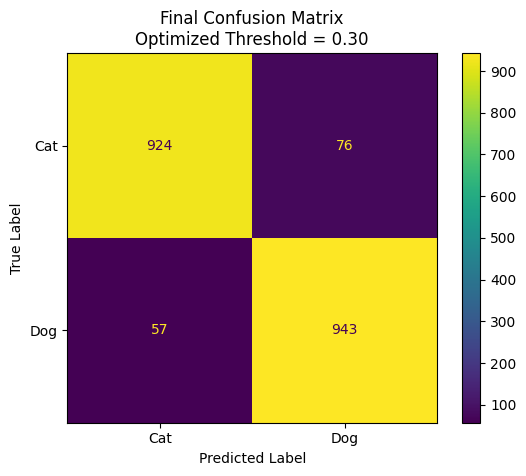
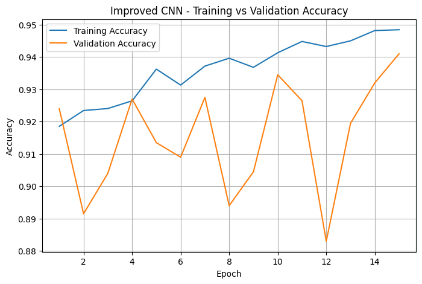
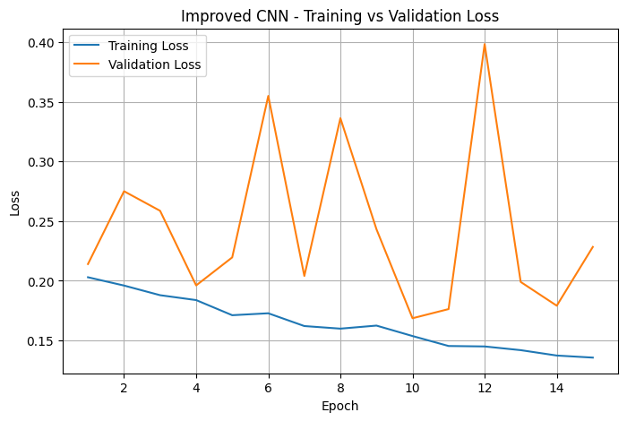
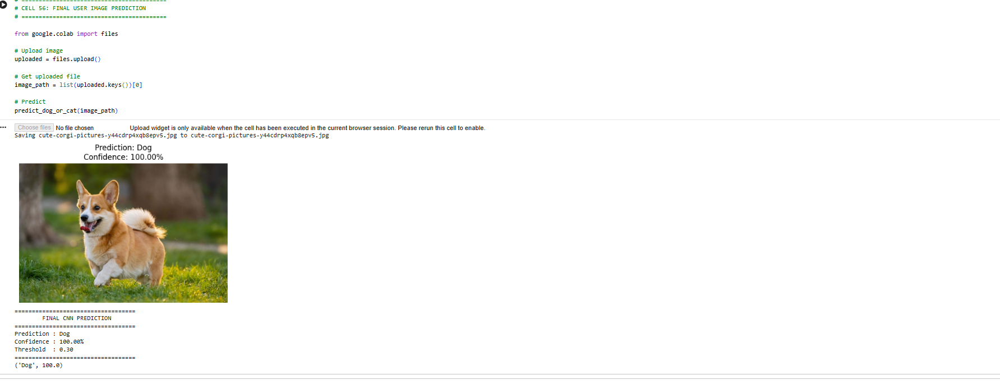

# dog-cat-cnn-classification
Dog vs Cat image classification using a CNN built from scratch with TensorFlow and Keras.
# 🐱🐶 Dog vs Cat Image Classification using CNN

## 📌 Project Overview

This project implements a binary image classification system
to classify images as either Cat or Dog using a Convolutional
Neural Network (CNN) built from scratch using TensorFlow and Keras.

The project was developed in Google Colab using a Kaggle dataset.

---

## 🎯 Objective

The objective of this project is to develop a CNN model that
can automatically learn visual features from images and classify
them into two classes:

- Cat
- Dog

---

## 📊 Dataset

Dataset Source: Kaggle

Dataset: Dogs & Cats Images

Total Images: 20,000

- Cats: 10,000
- Dogs: 10,000

Dataset Split:

- Training: 16,000 (80%)
- Validation: 2,000 (10%)
- Testing: 2,000 (10%)

---

## 🧠 Model Architecture

The CNN was built from scratch using TensorFlow/Keras.

Architecture:

Input (128 × 128 × 3)
↓
Data Augmentation
↓
Conv2D (32 filters)
↓
Batch Normalization
↓
Max Pooling
↓
Conv2D (64 filters)
↓
Batch Normalization
↓
Max Pooling
↓
Conv2D (128 filters)
↓
Batch Normalization
↓
Max Pooling
↓
Conv2D (256 filters)
↓
Batch Normalization
↓
Max Pooling
↓
Flatten
↓
Dense (128)
↓
Dropout (0.5)
↓
Sigmoid Output

---

## ⚙️ Preprocessing

- Images resized to 128 × 128 pixels
- RGB images with 3 channels
- Pixel values normalized from 0–255 to 0–1
- Data augmentation applied during training

Augmentation techniques:

- Random Horizontal Flip
- Random Rotation
- Random Zoom

---

## 🏋️ Training

- Framework: TensorFlow / Keras
- Optimizer: Adam
- Loss Function: Binary Crossentropy
- Epochs: 15
- Batch Size: 32
- Image Size: 128 × 128 × 3

---

## 📈 Results

Final optimized test performance:

| Metric | Result |
|---|---:|
| Accuracy | 88.50% |
| Precision | 85.98% |
| Recall | 92.09% |
| F1-Score | 88.98% |

Optimized classification threshold:

**0.77**

The CNN model was evaluated on 2,000 unseen test images.

- Accuracy: 88.50%
- Precision: 85.98%
- Recall: 92.09%
- F1-Score: 88.98%
- Optimized Threshold: 0.77

### Confusion Matrix



### Training Performance





### Sample Prediction



---

## 🔍 Prediction

The trained model can be used to classify a new unseen image
as either Cat or Dog and provide a confidence score.

---

## 🛠️ Technologies Used

- Python
- TensorFlow
- Keras
- NumPy
- Matplotlib
- Scikit-learn
- Google Colab
- Kaggle
  

---
## 🚀 How to Run


Open the notebook in Google Colab.

Install the required Python libraries.

Configure Kaggle API credentials.

Download the dataset.

Run the notebook cells sequentially.

Train the CNN model.

Evaluate the model.

Upload a new image for prediction.

📌 Note


The dataset itself is not included in this repository.


Kaggle API credentials such as kaggle.json are also not included
for security reasons.

---


## 📁 Project Structure

```text
dog-cat-cnn-classification/
│
├── CNN_Dog_Cat_Classification.ipynb
├── README.md
├── requirements.txt
├── .gitignore
│
├── model/
│   ├── dog_cat_cnn_model.keras
│   └── dog_cat_threshold.json
│
└── images/
    ├── confusion_matrix.png
    ├── training_graph.png
    └── prediction_example.png


